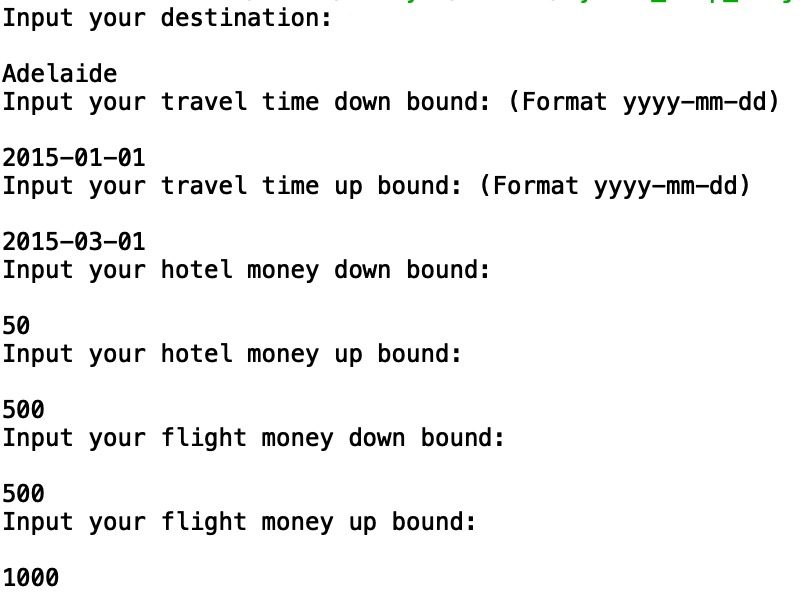
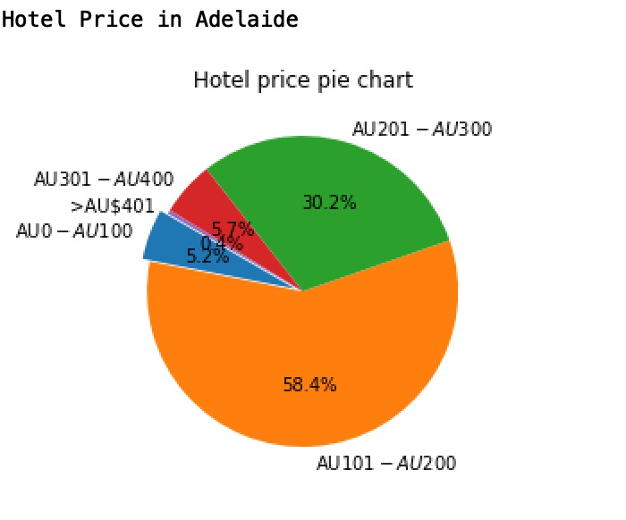
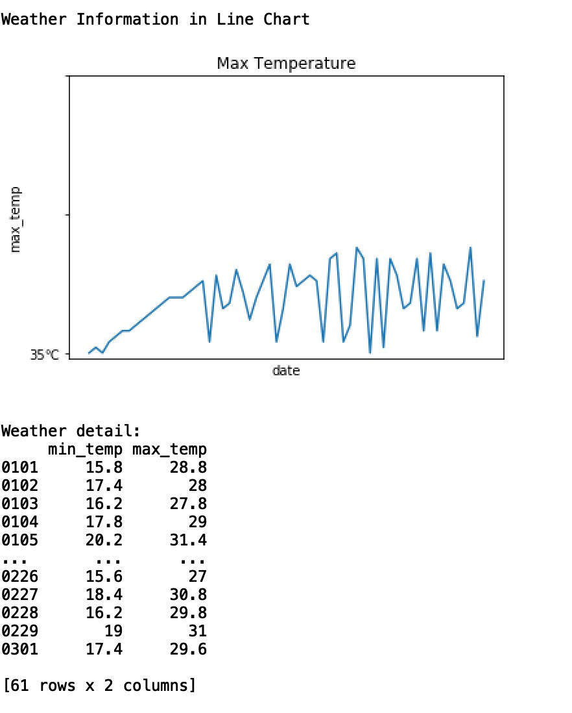
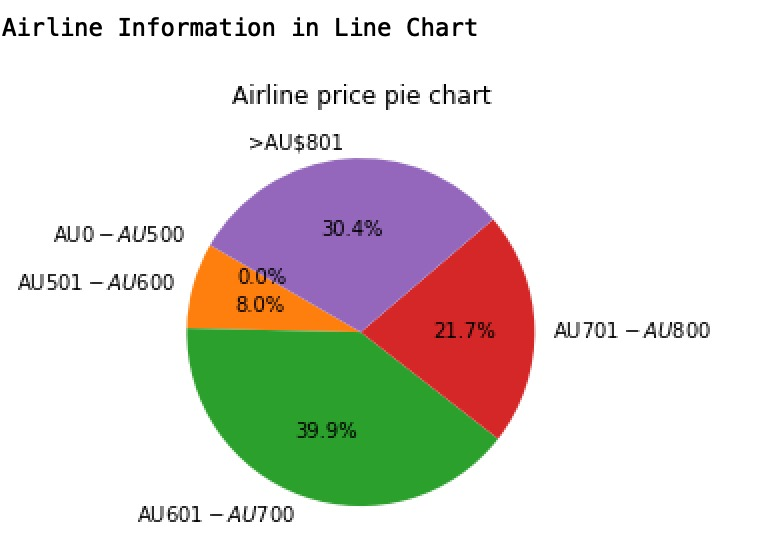
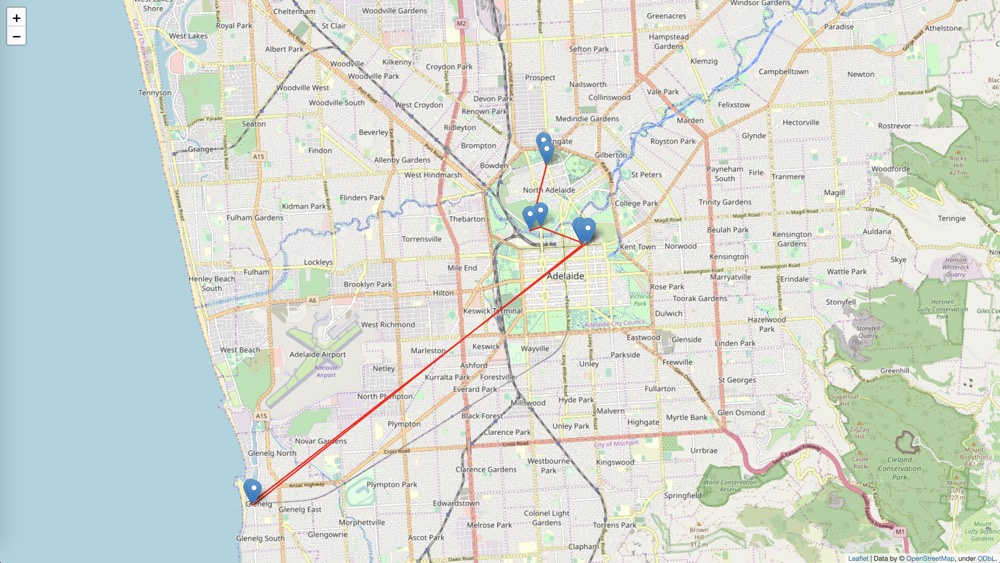
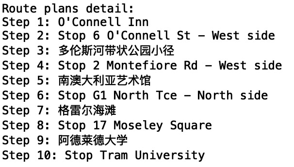
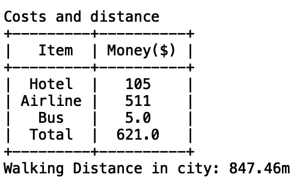
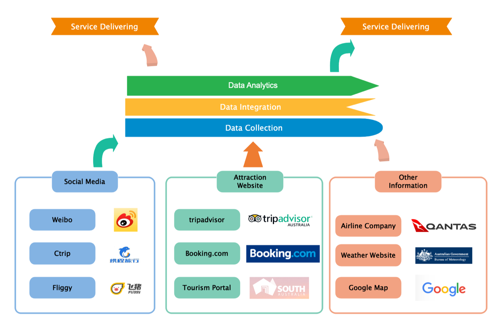
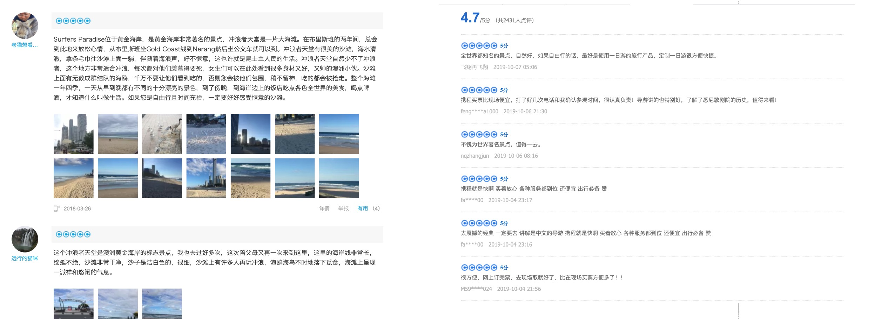

# Squad Travels, Inc. 


[](https://github.com/Marxh/Python_Trip_Project)

## 0. Group Members

Group name  | Andrew ID | Email
------------- | ------------- | -------------
Yuanli Gu  | Content Cell | 
Yuou Lei  | Content Cell |
Xinrui Zheng  | Content Cell |
Shanyue Wan  | shanyuew | shanyuew@andrew.cmu.edu
Rhea-Luz Valbuena | Content Cell | 

## 1. Criteria


## 2. Software
### 2.1. Abstract
**Squad Travels, Inc** is a software to provide comprehensive personalized suggestions for travellers from China. We scraped data including, geography data, social media comments, weather website, hotel data. Our suggestions are based on the integration of those information. Our version is to be the premier choice of Chinese travelers who want to travel to Australia for travel information needs. 

**Following is our core functions:**

- Route Guidance: Map and Trip Plans
- Airline Information Recommend
- Hotel Information Recommend
- Weather Information Display
- Calculate Distance and Total Costs
- Word Cloud Generation

### 2.2. Dependence

Library | Version 
------------- | ------------- 
pandas | 0.25.1
numpy | 1.16.4
matplotlib | 3.1.0 
folium | 0.10.0
wordcloud | 1.5.0
prettytable | 0.7.2
jieba | 0.39

### 2.3. File Structure
> main.py
> 
> graph_generator.py
>
> map_generator.py
>
> filter_suitable_service.py
>
> weather_analysis.py
>
> NLP
> > nlp_analytics.py 
> 
> dataset
> > AdelaideMetroStops_GDA2020.json
> > 
> > AdelaideMetroStops_GDA94.json
> > 
> > airline_data.xlsx
> > 
> > ctrip_cleaned_data.csv
> > 
> > hotel_data.xlsx
> > 
> > weather_data.xlsx

### 2.4. Library Install

Use command line: `pip install -r requirements.txt` to install all the python modules that you need.

### 2.5. Running

Running the main modle.

Input Mode: `Economy`/`Luxury`

Input City: `Adelaide`

Input Beginning Time: `2018-01-01`

Input Ending Time: `2018-04-01`

Input Down-Bound Hotel Price: `50`

Input Up-Bound Hotel Price: `500`

Input Down-Bound Flight Price: `500`

Input Up-Bound Flight Price: `1000`

### 2.6. Live Deomo
### a). Get Input


At the beginning, to get personalized services, customers should input their preferences. Based on the preference, our program can then give the services, travelling route they want.
<br />
<br />
<br />
<br />
<br />
<br />
<br />
<br />
<br />
<br />

### b). Hotel Price Pie Chart


Based on the output of the price range of the customer, our program displays the hotel information as a pie chart. Customers can know what percentage of the price range takes in the selected city.
<br />
<br />
<br />
<br />
<br />
<br />
<br />
<br />
<br />
<br />
### c). Temperature Line Chart


Our program will display the weather changes in the selected city. Detailed and past year's temperature will be displayed.
<br />
<br />
<br />
<br />
<br />
<br />
<br />
<br />
<br />
<br />
<br />
<br />
<br />
<br />
<br />
<br />
<br />
<br />
<br />
<br />
### d). Airline Price Pie Chart


Airline information will be displayed as pie chart. 
<br />
<br />
<br />
<br />
<br />
<br />
<br />
<br />
<br />
<br />
<br />
<br />
### e). Map Visualization


In the `map/map.html`, a route map will be displayed to guide the customers where to go and how to play in selected city. 
<br />
<br />
<br />
<br />
<br />
<br />
<br />
<br />
### f). Plan Steps


A more specific route plan will be displayed below.
<br />
<br />
<br />
<br />
<br />
<br />
<br />
<br />
### g). Cost and Distance Steps


Costs and diatance information about the route are displayed as table.
<br />
<br />
<br />
<br />
<br />
<br />
<br />
<br />

### h). Word Clouds


Word clouds corresponding with every spots are listed below. Each cloud demonstates the word that has the highest frequency in the comments.
<br />
<br />
<br />
<br />
<br />
<br />
<br />
<br />

## 3. Scrape

### 3.1. Abstract

Data sources we use include the follows:

- Ctrip comment data
- Weibo data
- Tripadvisor hotel data
- Weather data
- Airline data
- Adelaide Metro Bus data



### 3.2. Analytics Process


### 3.3. Ctrip Comments Scrape

Before running the flight data scraping program, please follow these steps:

- Download and install Chrome browser 
- Download chromedriver from https://sites.google.com/a/chromium.org/chromedriver/downloads. You must choose the chromedriver version based on your chrome browser version. 
- Uncompress the file and paste it to Python installation directory.

**Ctrip Scraping Library**

Library | Version 
------------- | ------------- 
pandas | 0.25.1
beautifulsoup4 | 4.8.0
selenium | 4.0.0a3

**Running**  
Run `ctrip_comment.py` to scrap the hotel information in Ctrip websites. After the sunning of this file, you will get the final raw comment data.

**Web Pages**  
Ctrip.com International, Ltd. (doing business as Ctrip) is a Chinese provider of travel services including accommodation reservation, transportation ticketing, packaged tours and corporate travel management.

In the codes, we discover two different page format in the comments page. So there are two parse logic, displaying following pages:




**Basic logic**

- Get all tourism urls from comment website `https://you.ctrip.com/countrysightlist/australia100048.html`
- Simulate Browser: get all the data hidden in html
- Simulate click: trun page

```python
page=1
while(page<=5):
    user_list = body.find('ul', {"class": "comments"})
    for user_info in user_list:
        for li in user_list:
            entry = {}
            h4 = li.find("h4")
            p = li.find("p")
            user_time = li.find("div", {'class': 'user-date'}).find('span')
            entry["city"] = city_name
            entry["place"] = place_name
            entry["rating"] = h4.text
            entry["comments"] = p.text
            entry["user_time"] = user_time.text
            entry["url"] = href
            df = df.append(entry, ignore_index=True)
    next_page = browser.find_element_by_class_name("down ")
    next_page.click()
    print(href + " page " + str(page) + " has been finished.")
    page += 1
```

- Use beautifulsoup to collect data

**Cleaning**  
Run clean_data.py to clean the data.

### 3.4. Hotel Data Scrape
**Hotel Scraping Library**

Library | Version 
------------- | ------------- 
Library| Version
pandas|0.24.2
numpy|1.16.1
beautifulsoup4|4.7.1
selenium|3.141.0

**Running**  
Run Hotel_Worm.py to scrap the hotel information in different Australia cities (Sydney, Melbourne, Adelaide, Canberra, Brisbane). After the sunning of this file, you will get four csv files which named as raw_data_hotel_SD.csv, raw_data_hotel_MEL.csv, raw_data_hotel_AD.csv, raw_data_hotel_CAN.csv, raw_data_hotel_BR.csv.


**Cleaning**  
Run Hotel_Clean.py to clean the data, which will replace the city column data from number to city name. Then it will slice the “AUD$” in price column. Finally, it will output Hotel_Clean.csv.

**Description**  
This script file will scrape hotel information from https://www.trivago.com.au/. The data fields include city, hotel name, customers’ rate, location and price. It is about different day’s price for each hotel from 2019.11.01 to 2019.11.29.

parameter | type | description | example |
------------- | ------------- | ------------- | ------------- |
city | string formula | The city which you want to look up | “Adelaide”,“Sydney”,“Melbourne”,“Canberra”,“Brisbane” |
time | string formula | the start date and end date you want to look up | DD-DD, like “01-02”, “29-30” |
name | string formula | Hotel name | “InterContinental Sydney” |
rate | string formula | Customer’s rate | “Excellent” |
type | string formula | Hotel type | “Hotel” |
location | string formula | Hotel location | “Sydney, 0.7 km to Sydney Opera House” |
price | string formula | Hotel price | “342” |

### 3.5. Airline Data
**Flight Scraping Library**

Library | Version 
------------- | ------------- 
pandas | 0.25.1
XlsxWriter | 1.2.1
beautifulsoup4 | 4.8.0
selenium | 4.0.0a3

Before running the flight data scraping program, please follow these steps:

- Download and install Chrome browser 
- Download chromedriver from https://sites.google.com/a/chromium.org/chromedriver/downloads. You must choose the chromedriver version based on your chrome browser version. 
- Uncompress the file and paste it to Python installation directory.

Then you can run the program and it will automatically scrape data from Trip.com and write it to Excel. The destinations include Sydney, Melbourne, Brisbane, Canberra and Adelaide.

**Data cleaning code**

Run the program and the names of departure airports and arrival airports will be translated into common language. Also the 'AU$' will be eliminated in the price column.

### 3.6. Weather Data
**Flight Scraping Code**

Library | Version 
------------- | ------------- 
pandas | 0.25.1
XlsxWriter | 1.2.1
beautifulsoup4 | 4.8.0
selenium | 4.0.0a3

Before running the flight data scraping program, please follow these steps:

- Download and install Chrome browser 
- Download chromedriver from https://sites.google.com/a/chromium.org/chromedriver/downloads. You must choose the chromedriver version based on your chrome browser version. 
- Uncompress the file and paste it to Python installation directory.

Then you can run the program and it will automatically scrape data from Trip.com and write it to Excel. The destinations include Sydney, Melbourne, Brisbane, Canberra and Adelaide.

**Data cleaning code**

Run the program and the names of departure airports and arrival airports will be translated into common language. Also the 'AU$' will be eliminated in the price column.